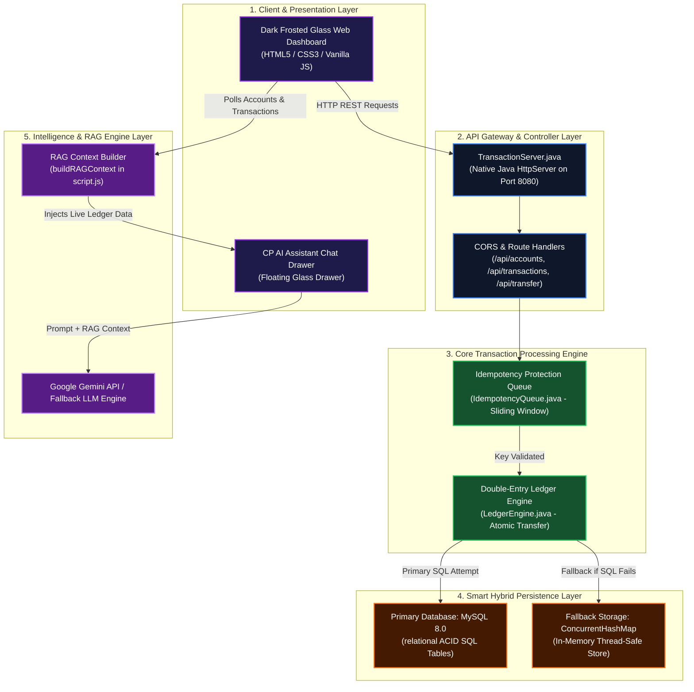
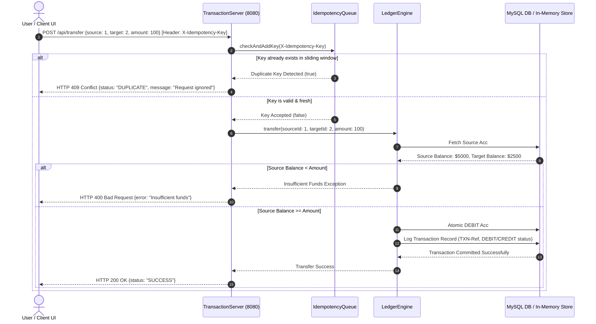

# CorePay | High-Performance Financial Ledger & RESTful API

[](https://www.oracle.com/java/)
[]()
[]()
[]()
[]()
[]()

**CorePay** is an enterprise-grade financial ledger engine and RESTful API built in Java. It handles atomic payment transfers, double-entry accounting logs, and sliding-window idempotency guarantees with zero-downtime hybrid storage fallback. It comes equipped with a modern dark frosted glass web dashboard and a real-time **AI RAG Financial Assistant** for transaction monitoring and account management.

---

## Web Dashboard Showcase

### 1. Payment Application Dashboard (Home View)


### 2. Transaction History & Audit Log (Double-Entry Log)


### 3. Send Money Transfer Modal (Preset Amounts & Idempotency)


### 4. Real-Time AI RAG Assistant Drawer (Live Ledger Intelligence)


---

## System Architecture & Data Flow

For detailed layer breakdowns and interviewer walkthrough guides, see [ARCHITECTURE.md](other_docs/ARCHITECTURE.md).

### 1. High-Level Architecture Diagram



### 2. End-to-End Payment Transfer Sequence



### 3. Double-Entry Accounting Data Flow

```
                       TRANSFER REQUEST: $100.00
                       Mridul (Acc #1) ──► Don (Acc #2)
                                   │
                                   ▼
                   ┌───────────────────────────────┐
                   │    Atomic Transaction Log     │
                   └───────────────┬───────────────┘
                                   │
                 ┌─────────────────┴─────────────────┐
                 ▼                                   ▼
    ┌───────────────────────────┐       ┌───────────────────────────┐
    │     DEBIT ENTRY           │       │     CREDIT ENTRY          │
    │ Source: Acc #1 (Mridul)   │       │ Target: Acc #2 (Don)      │
    │ Amount: -$100.00          │       │ Amount: +$100.00          │
    │ Balance: $4900.00         │       │ Balance: $2600.00         │
    └───────────────────────────┘       └───────────────────────────┘
                 │                                   │
                 └─────────────────┬─────────────────┘
                                   ▼
                ┌─────────────────────────────────────┐
                │ Accounting Verification Equation    │
                │     Sum(DEBIT) == Sum(CREDIT)       │
                │        -$100.00 + $100.00 = $0      │
                └─────────────────────────────────────┘
```

---

## Key Features & Architecture

- **Atomic Double-Entry Accounting:** Every transfer atomically logs matching `DEBIT` (source account) and `CREDIT` (target account) records, preserving system-wide balance integrity.
- **Dynamic Account Creation:** Supports creating new financial accounts on the fly via `POST /api/accounts` with auto-generated account numbers (`ACC-100X`) and dual-mode persistence (MySQL DB + In-Memory Store).
- **Idempotency Protection Engine:** Prevents duplicate charges or double transfers during network retries using custom `X-Idempotency-Key` deduplication.
- **Smart Hybrid Storage (Zero Downtime):** Connects to MySQL 8.0 for production storage and automatically falls back to a high-performance **In-Memory Store** if MySQL is offline.
- **Real-Time AI RAG Financial Assistant:** Floating glassmorphic widget querying live ledger data (liquidity metrics, accounts, recent transfers, double-entry rules) with dual-mode support for Google Gemini API or intelligent offline RAG engine fallback.
- **Dark Frosted Glass Web Dashboard:**
  - **Home View:** Virtual card display (`CorePay Vault`), system liquidity metrics, quick action pills, favorite transfer contacts, and recent transaction feeds.
  - **Cards & Accounts View:** Full account directory with instant search filtering, new account modal (`+ Add Account`), and quick transfer shortcuts.
  - **History View:** Complete audit trail showing `DEBIT` / `CREDIT` breakdowns for every transaction.
  - **Settings View:** Configurable API URLs, Gemini AI API key inputs, live polling rates (3s, 5s, 10s, manual), and system diagnostics.

---

## Repository Structure

```
core-pay/
├── README.md                  # Main Documentation
├── docs/
│   └── images/                # Dashboard Screenshots & UI Assets
│       ├── dashboard.png
│       ├── history.png
│       ├── transfer_modal.png
│       └── ai_assistant.png
├── other_docs/
│   ├── ARCHITECTURE.md        # Comprehensive Architecture & Flow Diagrams Guide
│   ├── KEY_FEATURES.md        # Feature Specifications & Technical Details
│   └── INTERVIEW_GUIDE.md    # Interview Preparation Cheat Sheet & Cross-Questions
├── frontend/
│   ├── index.html             # Multi-view Admin Dashboard HTML
│   ├── style.css              # Dark Frosted Glassmorphism UI styles
│   └── script.js              # SPA navigation, RAG AI Assistant, live polling, & API client
└── java-backend/
    ├── pom.xml                # Maven build configuration
    └── src/
        └── main/
            ├── java/com/corepay/
            │   ├── server/
            │   │   └── TransactionServer.java   # Native Java HTTP Server (Port 8080)
            │   ├── service/
            │   │   └── LedgerEngine.java        # Double-Entry Transfer Engine
            │   ├── dsa/
            │   │   └── IdempotencyQueue.java    # Sliding-window Deduplication Queue
            │   └── dao/
            │       ├── AccountDao.java           # Account Data Access (MySQL + In-Memory)
            │       ├── TransactionDao.java       # Audit Log Data Access
            │       └── DatabaseConnection.java   # Connection Pool Manager
            └── resources/
                └── db_schema.sql                # MySQL relational schema & seed data
```

---

## Quick Start Guide

### Step 1: Run Backend (Terminal 1)
```bash
cd java-backend
javac -d target/classes src/main/java/com/corepay/*/*.java src/main/java/com/corepay/*/*/*.java
java -cp target/classes com.corepay.server.TransactionServer
```

### Step 2: Run Frontend (Terminal 2)
```bash
cd frontend
python -m http.server 8000
```
*(Or simply double-click [frontend/index.html](file:///c:/Users/Mridul/Desktop/core-pay/frontend/index.html) to open directly in your browser)*

### Step 3: Access Application
Open your browser and visit: **`http://localhost:8000`**

---

## API Reference

Base URL: `http://localhost:8080/api`

### 1. Get Accounts
- **Endpoint:** `GET /api/accounts`
- **Response `200 OK`:**
```json
[
  {
    "id": 1,
    "accountNumber": "ACC-1001",
    "holderName": "Mridul",
    "balance": 4900.00,
    "currency": "USD"
  },
  {
    "id": 2,
    "accountNumber": "ACC-1002",
    "holderName": "Don",
    "balance": 2600.00,
    "currency": "USD"
  }
]
```

### 2. Create New Account
- **Endpoint:** `POST /api/accounts`
- **Headers:** `Content-Type: application/json`
- **Request Body:**
```json
{
  "holderName": "Charlie Brown",
  "balance": 1500.00,
  "currency": "USD"
}
```
- **Response `201 Created`:**
```json
{
  "id": 4,
  "accountNumber": "ACC-1004",
  "holderName": "Charlie Brown",
  "balance": 1500.00,
  "currency": "USD"
}
```

### 3. Get Transaction Audit Logs
- **Endpoint:** `GET /api/transactions`
- **Response `200 OK`:**
```json
[
  {
    "id": 101,
    "ref": "TXN-8F9A2B1C",
    "sourceId": 1,
    "targetId": 2,
    "amount": 100.00,
    "status": "COMPLETED",
    "createdAt": "2026-07-28 01:25:00"
  }
]
```

### 4. Execute Transfer
- **Endpoint:** `POST /api/transfer`
- **Headers:** `Content-Type: application/json`, `X-Idempotency-Key: key_123456`
- **Request Body:**
```json
{
  "sourceAccountId": 1,
  "targetAccountId": 2,
  "amount": 100.00
}
```
- **Response `200 OK`:**
```json
{
  "status": "SUCCESS",
  "message": "Transfer processed successfully"
}
```
- **Duplicate Request Response `409 Conflict`:**
```json
{
  "status": "DUPLICATE",
  "message": "Duplicate request ignored"
}
```

---

## MySQL Database Setup (Optional)

If you prefer using a persistent MySQL database instead of In-Memory mode:

1. Open MySQL terminal/workbench and execute [db_schema.sql](java-backend/src/main/resources/db_schema.sql):
   ```sql
   SOURCE java-backend/src/main/resources/db_schema.sql;
   ```
2. Ensure MySQL service `MYSQL80` is running on port `3306`.
3. The Java server will automatically detect MySQL and switch to SQL persistence mode!

---

## License
This project is open-source under the MIT License.
