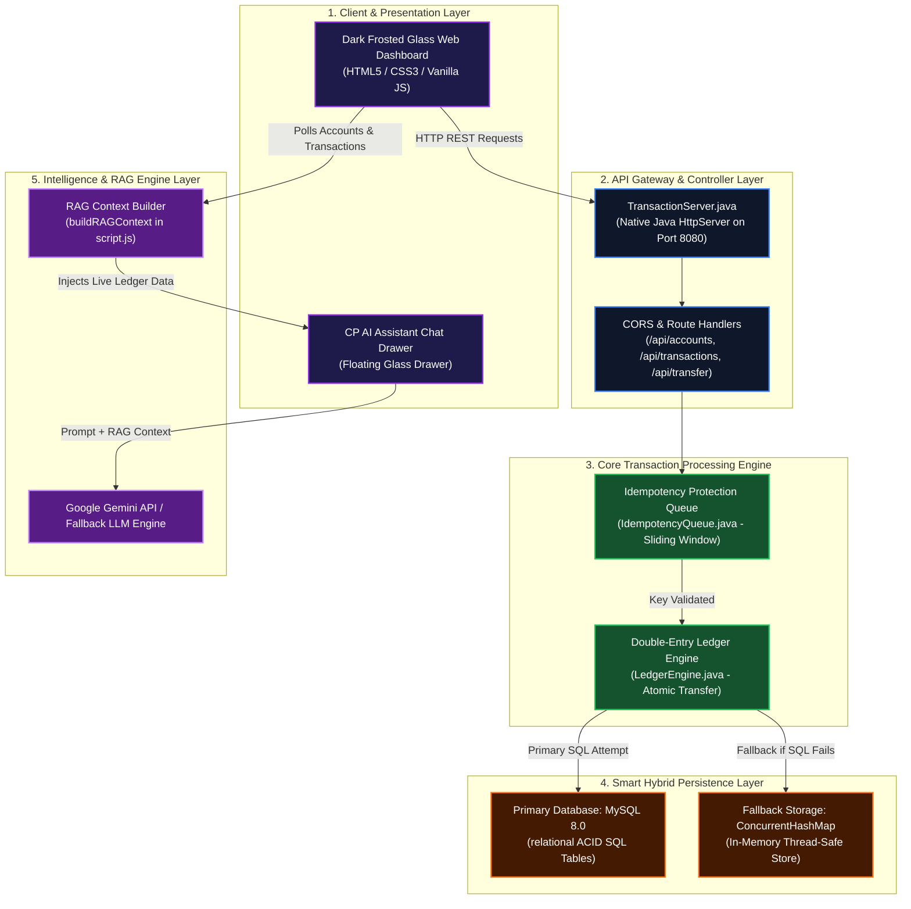
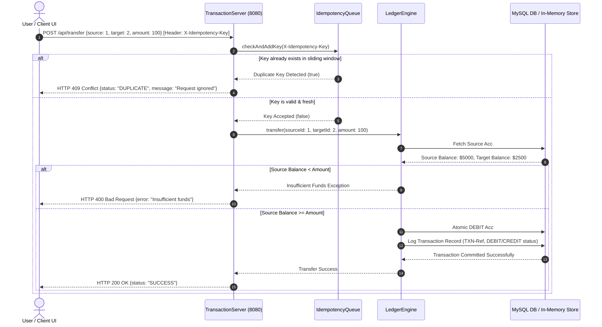

# CorePay | Comprehensive System Architecture & Data Flow Guide

This document presents a deep-dive architectural breakdown of **CorePay**. It explains every layer, component, data pipeline, and sequence step in detail to help you walk interviewers through the system.

---

## 1. High-Level System Architecture Diagram



---

## 2. Detailed Breakdown of Every Layer & Component

### Layer 1: Client & Presentation Layer
- **`index.html` & `style.css`:** Dark frosted glass single-page application (SPA) with iOS-style backdrop blur (`backdrop-filter: blur(35px)`), live liquidity counters, virtual debit card (`CorePay Vault`), quick contacts, and real-time activity tables.
- **`CP AI` Floating Widget:** Glassmorphic drawer providing a natural language interface for financial queries.

### Layer 2: API Gateway & Controller Layer
- **`TransactionServer.java`:** Built using native `com.sun.net.httpserver.HttpServer` listening on port `8080`.
- **CORS & Headers:** Automatically attaches `Access-Control-Allow-Origin: *` and extracts custom headers (`X-Idempotency-Key`).
- **REST Endpoints:**
  - `GET /api/accounts` -> Returns active account list and balance balances.
  - `GET /api/transactions` -> Returns historical DEBIT/CREDIT audit entries.
  - `POST /api/transfer` -> Triggers atomic money transfer execution.

### Layer 3: Core Transaction Processing Engine
- **`IdempotencyQueue.java` (Deduplication Guard):**
  - Maintains a sliding-window queue (capacity: 1000 keys) of recent `X-Idempotency-Key` headers.
  - If a duplicate key is detected within the window, the request is intercepted immediately and returned as HTTP `409 Conflict` duplicate without executing the transfer.
- **`LedgerEngine.java` (Atomic Transfer Engine):**
  - Validates source and target account existence and checks for sufficient balance (`source.balance >= amount`).
  - Generates matching **DEBIT** (source account deduction) and **CREDIT** (target account addition) records in a single atomic transaction.

### Layer 4: Smart Hybrid Persistence Layer (Zero-Downtime Dual Storage)
- **Primary Storage (MySQL 8.0):** Relational tables (`accounts`, `transactions`, `ledger_entries`, `idempotency_keys`) managed via `DatabaseConnection.java` with JDBC driver `com.mysql.cj.jdbc.Driver`.
- **Fallback Storage (`ConcurrentHashMap`):** If MySQL connection fails or is offline, DAOs (`AccountDao.java`, `TransactionDao.java`) automatically catch `SQLException` and route read/write operations to thread-safe `ConcurrentHashMap` and `CopyOnWriteArrayList` structures in memory.
- **Result:** Zero system downtime even during database crashes.

### Layer 5: Intelligence & RAG Engine Layer
- **RAG Context Extractor (`buildRAGContext()`):** Captures total system liquidity, active accounts, balances, and recent transaction audit logs into a structured markdown prompt context.
- **LLM Engine:** Injects context + user query into Google Gemini API or processes query through built-in RAG intent processor.

---

## 3. End-to-End Sequence Diagram: A $100 Payment Transfer



---

## 4. Double-Entry Accounting Data Flow

In CorePay, money is never simply deleted from one row and added to another. Every transaction creates a **verifiable accounting pair**:

```
                       TRANSFER REQUEST: $100.00
                       Mridul (Acc #1) ──► Don (Acc #2)
                                   │
                                   ▼
                   ┌───────────────────────────────┐
                   │    Atomic Transaction Log     │
                   └───────────────┬───────────────┘
                                   │
                 ┌─────────────────┴─────────────────┐
                 ▼                                   ▼
    ┌───────────────────────────┐       ┌───────────────────────────┐
    │     DEBIT ENTRY           │       │     CREDIT ENTRY          │
    │ Source: Acc #1 (Mridul)   │       │ Target: Acc #2 (Don)      │
    │ Amount: -$100.00          │       │ Amount: +$100.00          │
    │ Balance: $4900.00         │       │ Balance: $2600.00         │
    └───────────────────────────┘       └───────────────────────────┘
                 │                                   │
                 └─────────────────┬─────────────────┘
                                   ▼
                ┌─────────────────────────────────────┐
                │ Accounting Verification Equation    │
                │     Sum(DEBIT) == Sum(CREDIT)       │
                │        -$100.00 + $100.00 = $0      │
                └─────────────────────────────────────┘
```

---

## 5. RAG AI Assistant Architecture

```
  ┌────────────────────────┐      ┌────────────────────────┐
  │   Live Account Balances │      │ Transaction Audit Logs │
  └───────────┬────────────┘      └───────────┬────────────┘
              │                               │
              └───────────────┬───────────────┘
                              ▼
           ┌─────────────────────────────────────┐
           │      RAG Context Extractor          │
           │      (buildRAGContext in JS)        │
           └──────────────────┬──────────────────┘
                              │ Injects Live Data
                              ▼
           ┌─────────────────────────────────────┐
           │     LLM System Prompt Construction  │
           │  "You are CorePay AI. Context: ..." │
           └──────────────────┬──────────────────┘
                              │
                              ▼
           ┌─────────────────────────────────────┐
           │  Google Gemini API / Fallback LLM   │
           └──────────────────┬──────────────────┘
                              │
                              ▼
           ┌─────────────────────────────────────┐
           │ Accurate Answer (Zero Hallucination)│
           └─────────────────────────────────────┘
```

---

## 6. How to Walk an Interviewer Through This Architecture

1. **Start at Layer 1 (Client):** Mention the glassmorphic SPA UI communicating with backend via REST JSON payloads.
2. **Move to Layer 2 (Server Gateway):** Explain that the server is built natively in Java (`HttpServer` on port `8080`) to eliminate framework overhead.
3. **Highlight Layer 3 (Core Processing):** 
   - Point out that requests **must pass `IdempotencyQueue` first** to stop duplicate transactions.
   - Explain how `LedgerEngine` enforces **Double-Entry Accounting** (`DEBIT` + `CREDIT`) for mathematical integrity.
4. **Detail Layer 4 (Hybrid Storage):** Explain the automatic failover from **MySQL 8.0 SQL database** to **thread-safe In-Memory storage (`ConcurrentHashMap`)**, ensuring zero system downtime.
5. **Conclude with Layer 5 (AI RAG):** Describe how live accounts and transaction logs are extracted into RAG prompt context so the AI Assistant answers financial questions accurately.
